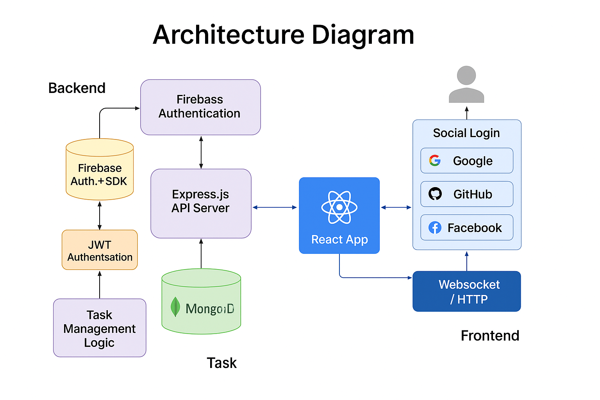

# Todo Task Management Web App 📝

A full-stack Todo application built for the Katomaran Hackathon.

## 🔗 Live Links

- 🌐 **Frontend (Vercel)**: [https://todo-frontend-ruby-delta.vercel.app](https://todo-frontend-ruby-delta.vercel.app)
- 🔧 **Backend (Render)**: [https://todo-backend-o2ho.onrender.com](https://todo-backend-o2ho.onrender.com)
  
## 🚀 Deployment

- **Frontend (Vercel)** 👉 [Live App](https://todo-frontend-ruby-delta.vercel.app)
- **Backend (Render)** 👉 [API Server](https://todo-backend-o2ho.onrender.com/)

## Frontend + Backend project Link  -->  [App link](https://todo-frontend-nyyjdpgbq-nivas-projects-03ed492c.vercel.app/)
## 🚀 Features

- OAuth2 Login with Google
- Create, update, delete, filter, and share tasks
- Real-time updates using WebSockets
- Responsive design (Mobile + Desktop)
- Error boundaries, loading states, and toasts

## 🧠 Assumptions

- For login, we implemented only Google Login
- Task sharing is via registered user email (not public)
- Real-time is via WebSocket polling fallback (not Firebase)
- MongoDB Atlas is used as the database

## 📐 Architecture




## 🔧 Tech Stack

| Layer      | Tech                       |
|------------|----------------------------|
| Frontend   | React (Vite), Axios        |
| Backend    | Node.js, Express.js        |
| Auth       | Firebase Authentication    |
| Database   | MongoDB Atlas              |
| Real-Time  | WebSockets (socket.io)     |
| Hosting    | Frontend - Vercel          |
|            | Backend - Render           |

## 🛠️ Setup Instructions

### 1. Clone Repo

```bash
git clone https://github.com/YourUsername/todo-app-hackathon.git
cd todo-app-hackathon
